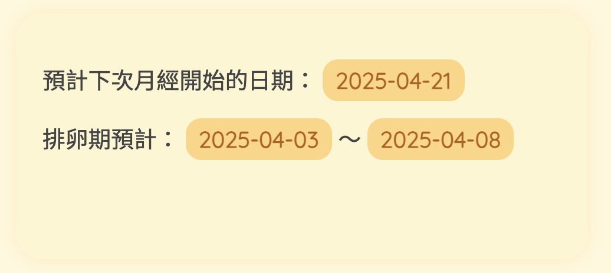
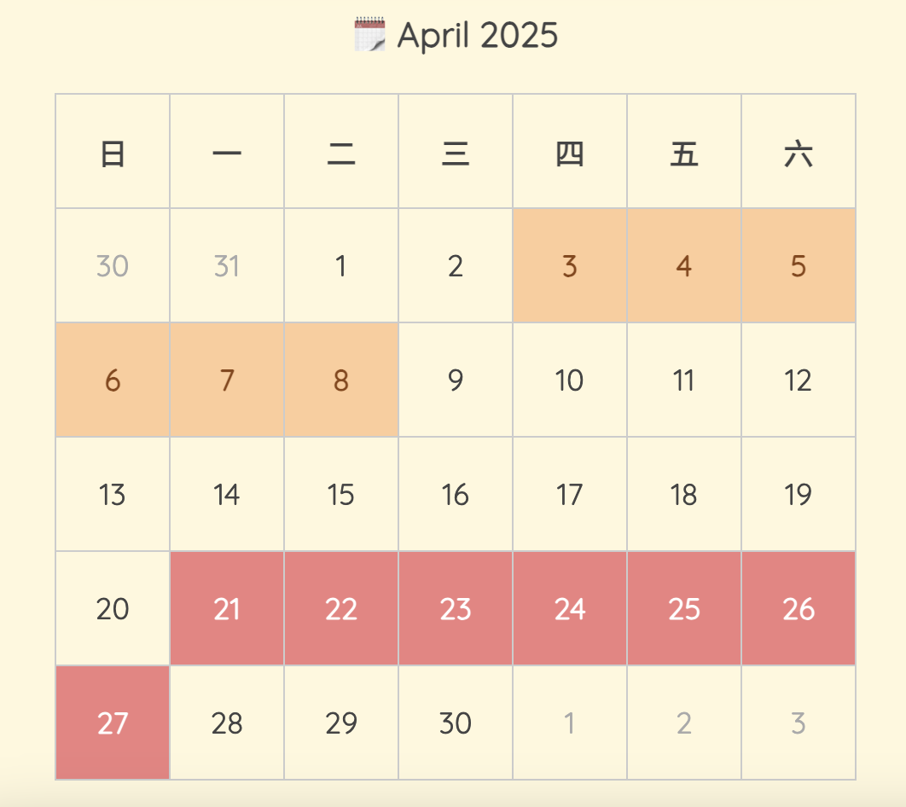

#  月經與排卵日曆計算器 

這個專案是一個簡單的排卵與月經計算器，根據使用者輸入的資料（上次月經開始日期、週期天數、月經天數），計算並顯示預計的排卵期與下次月經的日期，並以日曆形式顯示。

## 功能
- 根據使用者輸入的資料，計算出下次月經的開始日期及排卵期。
- 顯示當月及下月的日曆，並以不同顏色標註顯示排卵期與月經期間。

## 使用畫面示意

### 🔸 使用者輸入畫面

### 🔸 計算結果畫面

### 🔸 排卵期與月經顯示的日曆

## 技術堆疊
- **Flask**：用於後端處理。
- **HTML / CSS**：用於前端頁面呈現。
- **Python**：用於日期計算與邏輯處理。
- **Bootstrap**：可以進行視覺化優化。

## 使用方法

1. 複製這個倉庫：
   
   git clone `https://github.com/tingchen1992/period-ovulation-calendar.git`

2. 進入專案資料夾：
`cd period-ovulation-calendar`

3. 安裝必要的 Python 套件：
`pip install -r requirements.txt`

4. 啟動應用程式：
`python app.py`

5. 打開瀏覽器並訪問 `http://127.0.0.1:5000/`

## 功能說明
### 月經與排卵期計算邏輯
1. 使用者輸入上次月經開始日期、平均週期天數與月經天數。
2. 應用程式會計算下次月經的開始日期與排卵期的範圍。
3. 結果會以文字與日曆形式呈現。

